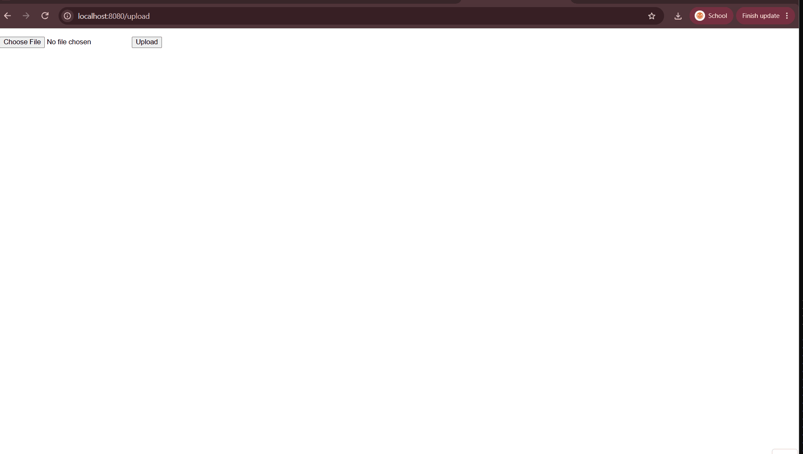

# Flask on Docker


## Overview

This repo is a containerized Flask website that is dependent on a Postgres database, which stores all necessary data. We used Flask and Gurnicorn in order to run the basic functions of this tool. In order to handle all of the requests, we used Nginx as a doorstop that execute basic functions or refer more complex tasks to Flask and Gurnicon. The app supports uploading an image and viewing it in the browser, as shown below.



## Build Instructions

### Setup

Build and start the services:

```
docker compose up -d --build
```

The app is then available at http://localhost:1145/. Upload an image at http://localhost:1145/upload and view it at http://localhost:1145/media/IMAGE_FILE_NAME.

Stop the services and remove their volumes:

```
docker compose down -v
```

### Execute!

Production database credentials are not stored in this repo. Create a file named `.env.prod.db` in the project root, with values matching the user, password, and database name in the `DATABASE_URL` line of `.env.prod`:

```
POSTGRES_USER=<user>
POSTGRES_PASSWORD=<password>
POSTGRES_DB=<database name>
```

Build and start the services, then create the database table:

```
docker compose -f docker-compose.prod.yml up -d --build
docker compose -f docker-compose.prod.yml exec web python manage.py create_db
```

Nginx serves the app at http://localhost:1145/. Upload an image at http://localhost:1145/upload and view it at http://localhost:1145/media/IMAGE_FILE_NAME.

Stop the services and remove their volumes:

```
docker compose -f docker-compose.prod.yml down -v
```
